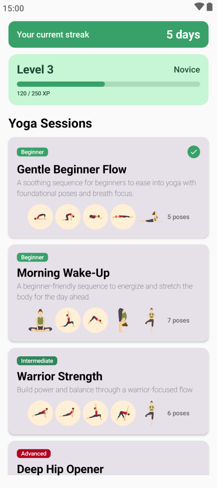
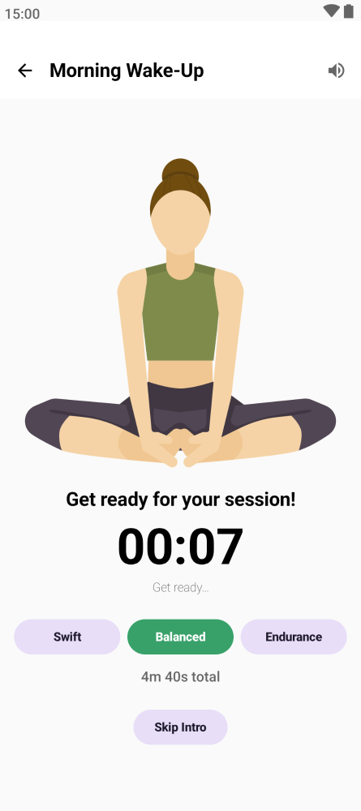
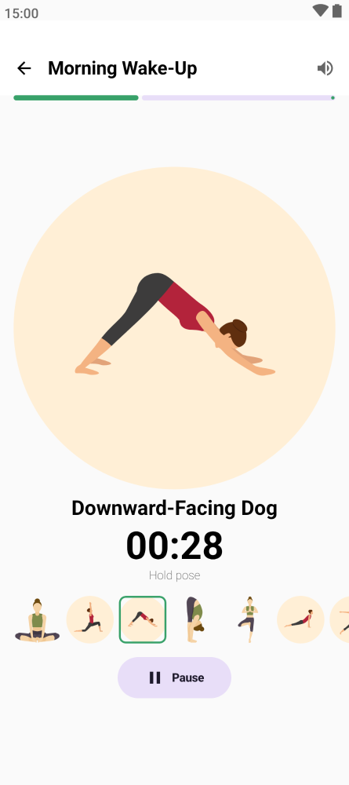
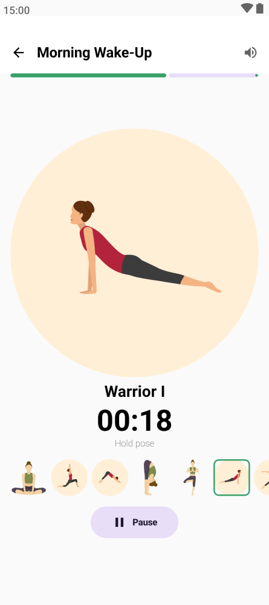
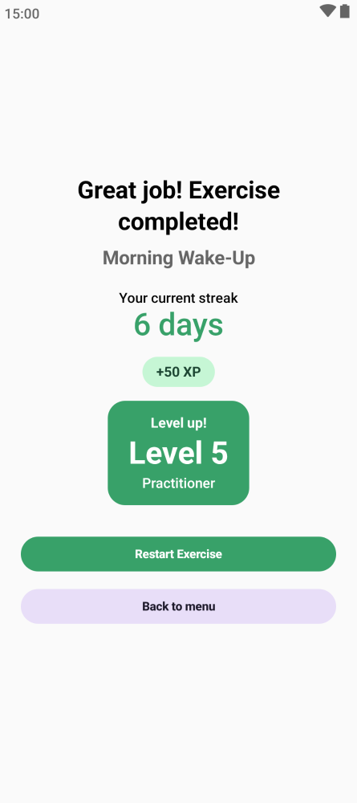

# YogaBase

A Kotlin Multiplatform / Compose Multiplatform yoga practice app. Browse poses, follow guided sessions with voice guidance, and track your streak.

Runs on Android, iOS, Desktop (macOS/Windows/Linux), and the web (WASM).

## Screenshots

<p>
  
  
  
  
  
</p>

## Build

```bash
# Android
./gradlew :androidApp:installFossDebug

# Desktop (current OS)
./gradlew :composeApp:run

# Web (WASM)
./gradlew :composeApp:wasmJsBrowserRun

# iOS
open iosApp/iosApp.xcodeproj   # then build & run in Xcode
```

## Regenerating screenshots

Snapshots are produced by Paparazzi in the `:screenshotTests` module.

```bash
# Record snapshots (phone + tablet, all sizes)
./gradlew :screenshotTests:recordPaparazziDebug

# Copy the chosen snapshots to media/ for this README
./gradlew :screenshotTests:updateScreenshots

# Copy Play Store-sized snapshots to fastlane/metadata/android/en-US/images/
./gradlew :screenshotTests:generateStoreScreenshots
```

## License

MIT — see [LICENSE](LICENSE).
