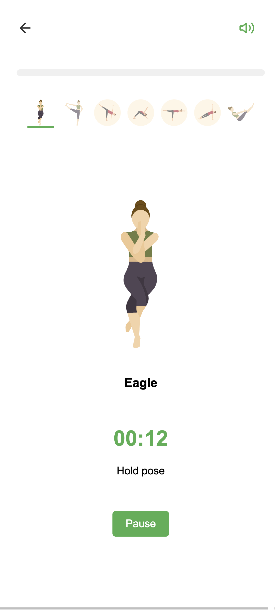
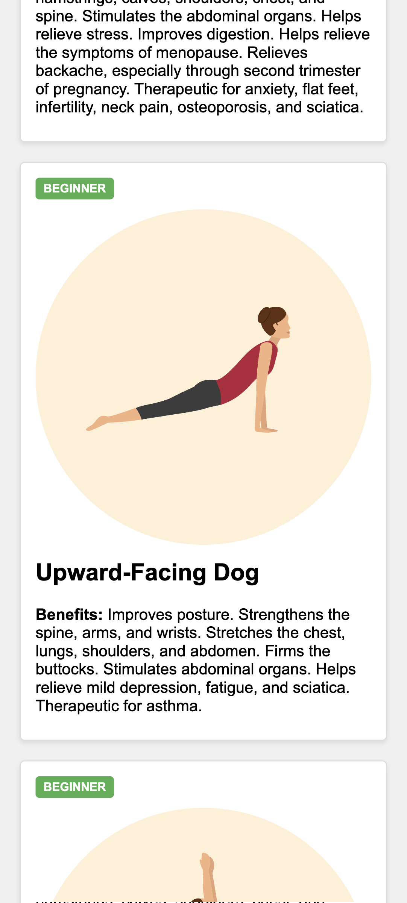
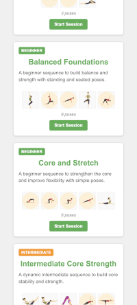

# YogaBase

A web application for exploring and practicing yoga poses with guided sessions.

## Screenshots

  

## Features
 - Browse yoga poses organized by categories
 - Start guided sessions with customizable difficulty levels
 - Voice guidance with pose descriptions
 - Visual progress tracking during practice
 - Streak and completion tracking

## License
This project is licensed under the MIT License - see the [LICENSE](LICENSE.md) file for details.

## Credits
Uses the Yoga API by Alexis Sri.
