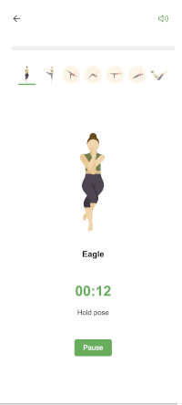
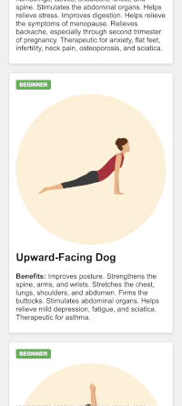

# YogaBase

A web application for exploring and practicing yoga poses with guided sessions.

## Screenshots

  

## Features
 - Browse yoga poses organized by categories
 - Start guided sessions with customizable difficulty levels
 - Voice guidance with pose descriptions
 - Visual progress tracking during practice

## Technologies
 - HTML/CSS/JavaScript
 - Web Speech API for voice guidance
 - Responsive design

## Credits
Uses the Yoga API by Alexis Sri.
